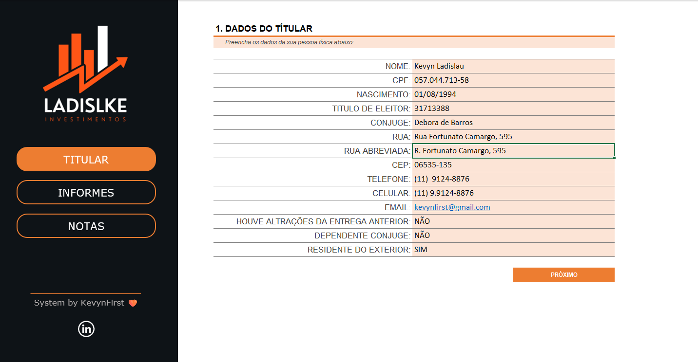

  

  <a href="#-tecnologias">Tecnologias</a>&nbsp;&nbsp;&nbsp;|&nbsp;&nbsp;&nbsp;
  <a href="#-projeto">Projeto</a>&nbsp;&nbsp;&nbsp;|&nbsp;&nbsp;&nbsp;
  <a href="#-preview">Preview</a>

  
  	  

 

## 🚀 Tecnologias

Esse projeto foi desenvolvido com a ferramenta microsoft [excel](https://www.microsoft.com/pt-br/microsoft-365/excel).

   
   

## 📖 Projeto

Este projeto faz parte da prática do curso [Excel com inteligência artificial](https://ebaconline.com.br/analista-de-dados), da plataforma Dio.me. Este projeto tem como objetivo criar uma ferramenta no Excel que ajude a organizar e reunir informações essenciais para a declaração de imposto de renda. A proposta é construir um agregador de dados no qual o usuário possa controlar suas entradas de maneira eficiente e validada, com menus de navegação, validações automáticas e funcionalidades extras, como links rápidos. A solução será completamente construída no Excel, com recursos que tornam a ferramenta robusta, mas com uma interface amigável e prática.
 
 

## 🖥 Preview

  

### Como Executar

Basta baixar o arquivo em .xlsx [aqui](https://github.com/KevynFirst/organizador-impostos-excel/blob/eb040e02a27bf9fbfba07eece0ce216ac853a9f8/organizador-impostos-excel.xlsx). 👈🏻
 Para uma melhor experiencia, deixe a planilha em fullscreen.
 

## 😉 Obrigado por visitar meu projeto

Você pode conferir outros projetos que desenvolvi aqui no meu GitHub, ou entrar em contato comigo pelos demais links.

